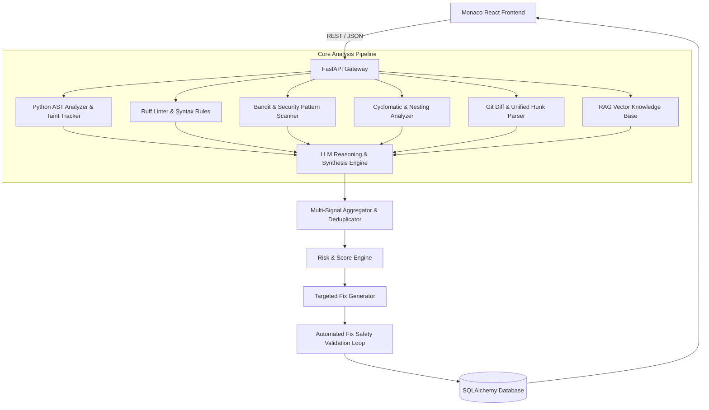

# System Architecture & Technical Design

## 1. Overview & Core Tenet: "AI + Deterministic Software Engineering"

The **AI Code Review Assistant** is designed to avoid the common pitfalls of simple "LLM wrappers". Instead, it utilizes a **Multi-Tier Hybrid Analysis Pipeline** where deterministic static analyzers, AST parsers, security scanners, and vector-based RAG engines extract precise structured signals before invoking LLM contextual reasoning.

---

## 2. Multi-Tier Analysis Pipeline Breakdown

### Tier 1: Abstract Syntax Tree (AST) & Taint Tracking
- Traverses Python AST using `ast.NodeVisitor`.
- Tracks local variable assignments to detect taint propagation (e.g. dynamic SQL strings formatted via f-strings or concatenation before being passed into `cursor.execute()`).
- Identifies mutable default arguments in functions (`def foo(cache=[])`).
- Detects bare `except:` clauses and silently swallowed exceptions (`except Exception: pass`).
- Computes exact cyclomatic complexity per function (McCabe algorithm) and flags functions with CC > 10.

### Tier 2: Deterministic Static Analysis (Ruff & Radon)
- Executes Ruff linter rules in isolated subprocess passes (`ruff check --output-format=json`).
- Extracts syntax anomalies, unused imports (`F401`), undefined variables (`F821`), and style rule infractions with precise column/row ranges.

### Tier 3: Security Scanner (Bandit + Regex Entropy)
- Maps Bandit security test IDs (B101 to B703) to categorized vulnerability entries.
- High-entropy pattern matching detects exposed AWS keys (`AKIA...`), GitHub Personal Access Tokens (`ghp_...`), hardcoded JWT secrets, and private cryptographic keys.

### Tier 4: Git Diff & Unified Hunk Analyzer
- Parses unified diff streams (`diff --git a/... b/...`).
- Maps added (`+`) vs deleted (`-`) lines to prioritize review focus on changed code while preserving surrounding context.

### Tier 5: Project-Aware RAG Context Retriever
- In-memory vector store with TF-IDF cosine similarity embeddings.
- Retrieves project-specific architecture guidelines (e.g. *"All database queries must use repository classes"*), ensuring the review enforces organization-specific rules.

### Tier 6: Multi-Signal Aggregator & Deduplication
- Merges overlapping findings targeting the same line or vulnerability concept into single unified findings.
- Combines evidence: e.g. `evidence_sources: ["Bandit (B608)", "AST (Unsafe SQL Formatting)", "LLM (Unsanitized User Input)"]`.
- Calibrates confidence boost for multi-signal confirmed issues (e.g. 0.80 -> 0.98).

### Tier 7: Automated Fix Safety Validation Loop
- Generates side-by-side patch replacement.
- Re-runs Python syntax check (`ast.parse`) on patched in-memory buffer.
- Re-runs AST & Security Scanners on patched code.
- Verifies that the targeted vulnerability is completely eradicated and no new regressions were introduced.

---

## 3. Database Schema

The system uses SQLAlchemy ORM with relationships:
- `User`: Email, username, bcrypt password hash, roles.
- `Repository`: GitHub repository metadata and user associations.
- `PullRequest`: PR numbers, branches, commit metadata, changed files, and unified diffs.
- `Review`: Comprehensive review session records, overall score (0-100), letter grade (A+, A, B, C, D, F), risk level, execution time, SLOC metrics.
- `ReviewIssue`: Line-level findings, category, severity, confidence, evidence sources.
- `ReviewFix`: Generated diffs, rationale, and automated validation results.
- `ProjectRule`: Vector-embedded guidelines for RAG retrieval.
- `EvaluationRun`: Historical benchmark precision/recall/F1 logs.
